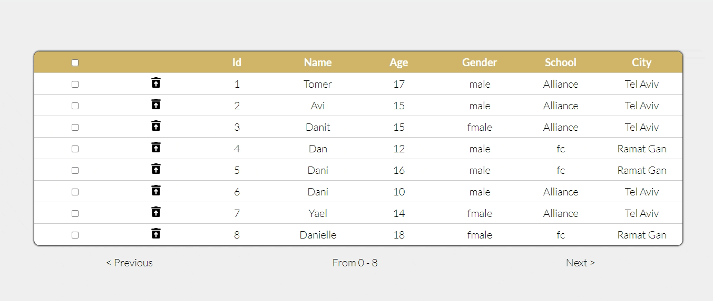

<p align="center">
  <h3 align="center">Students List</h3>
  <p align="center">Fibonatix test - Modify Students List (delete and edit).</p>
</p>


  <summary><h2 style="display: inline-block">Content</h2></summary>
  <ol>
    <li>
      <a href="#about-the-project">About The Project</a>
      <ul>
        <li><a href="#built-with">Built With</a></li>
      </ul>
    </li>
    <li>
      <a href="#getting-started">Getting Started</a>
      <ul>
        <li><a href="#installation">Installation</a></li>
      </ul>
    </li>
    <li><a href="#File">File Hierarchy</a></li>
    <li><a href="#acknowledgements">Acknowledgements</a></li>
      <li><a href="#features">Main Features</a></li>
  </ol>


<!-- ABOUT THE PROJECT -->
## About The Project


Fibonatix test - Modify Students List (delete and edit).

### Built With

* [React](https://reactjs.org/) (Typescript)
* [axios](https://www.npmjs.com/package/axios)
* [enzyme](https://enzymejs.github.io/enzyme/) (for testing)

## Getting Started
To get a local copy up and running follow these simple steps.


### Installation

1. Clone the repo
   ```sh
   git clone https://github.com/tomeraitz/Fibonatix-Students.git
   ```
2. Install NPM packages
   ```sh
   npm install
   ```
3. Run Test
   ```sh
   npm test
   ```
4. Run the project
    ```sh
   npm start 
   ```
**Note!** The data is saved in localStorage - if you want to refresh the data do `localStorage.clear()`


<!-- USAGE EXAMPLES -->
<h3 id="File">File Hierarchy</h3>

**src**
-  **assets**
    - **styles**  - The main styles in use on all the components.
-  **components**
    - **Containers** - This project builds on the concept of `Containers and Presentational` patterns - the Containers will have the main functionalities.
        - **App** - The main component that renders in the beginning. Here we can find the functionality of modifying the data.
        - **StudentsList** - This is the main page, the user can see the students list (delete or edit them). Here we can find the UI functionality.
    - **Presentational** - All the simple components. You can see that all the components are function except **`Input`**. Although it has a `state` I still see it as `Presentational`, the `state` doesn't impact the app functionally like the container components.
-  **models** - All the main models (types declaration) that are in use in the app.
-  **services**
    - **httpRequest.service** - Handles all the HTTP requests.
## Acknowledgements
* API made with [mocky.io](https://designer.mocky.io/)
* The Read me file was created with the template [Best-README-Template](https://github.com/othneildrew/Best-README-Template)


<h3 id="features">Main Features</h3>

- Responsive Design
- Error Input Handle
- Get Data From API
- Tests
- Delete Data
- Edit Data
- Save in localStorage
